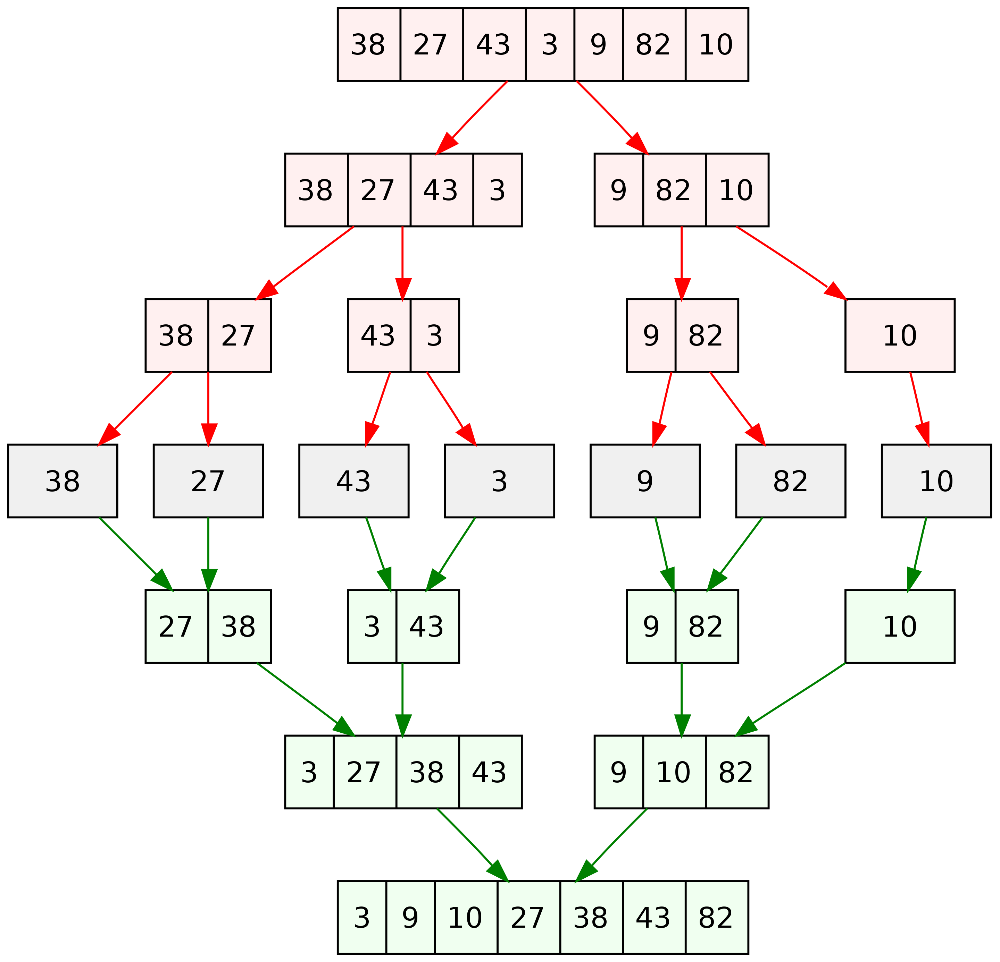

# Merge Sort

## How merge sort works?

1. Find the middle point to divide the array into two halves: `middle m = l + (r – l)/2`
2. Call mergeSort for first half: `Call mergeSort(arr, l, m)`
3. Call mergeSort for second half: `Call mergeSort(arr, m + 1, r)`
4. Merge the two halves sorted in steps 2 and 3: `Call merge(arr, l, m, r)`

# Big-O

$O(n log(n))$